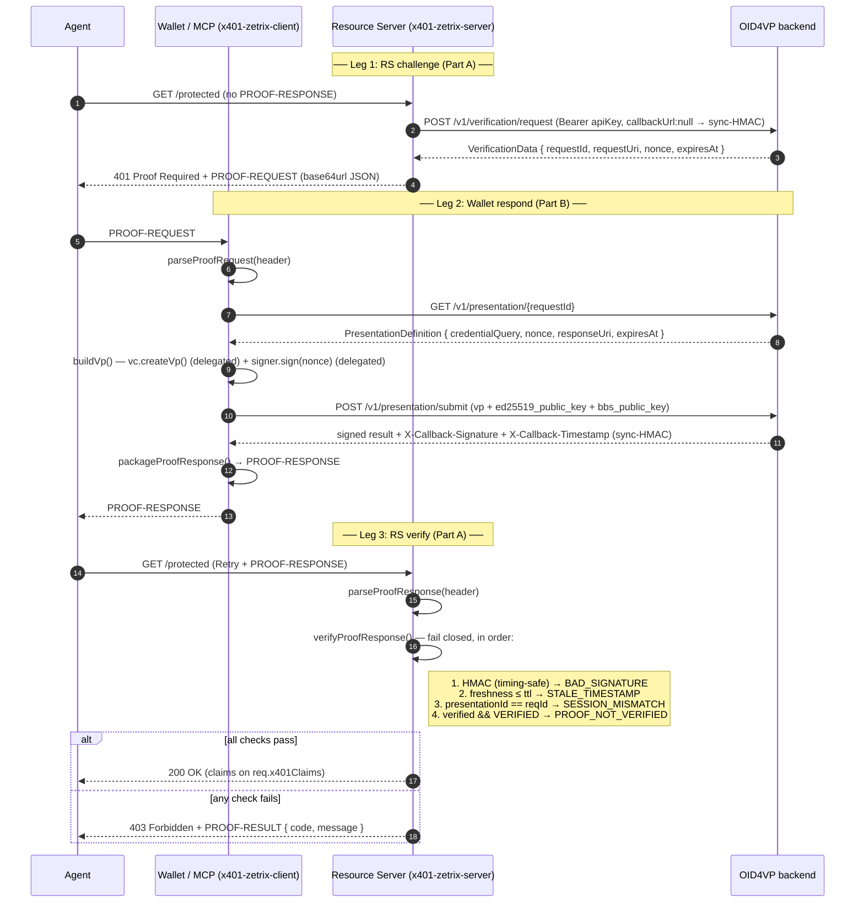

# Flows

> Cross-references: §01 for architecture, §04/§05 for the APIs, §08 for the wire contract.

## The 401 Proof-Required sequence (both legs)

The agent (via its wallet/MCP) hits a protected route. **Part A (server)** challenges;
**Part B (client)** parses the challenge, obtains a proof, and relays a `PROOF-RESPONSE`;
Part A verifies, and the route is served or rejected. The two legs below are the two SDKs.

## Step-by-step

### Leg 1 — RS challenge (Part A)

1. **Request without proof** — the agent calls a protected route with no `PROOF-RESPONSE`.
2. **Mint verification request** — the SDK calls `POST /v1/verification/request` with the
   Bearer API key and `callbackUrl: null` (sync-HMAC). Transport failure →
   `OID4VP_UNAVAILABLE`; non-2xx → `REQUEST_CREATE_FAILED`.
3. **Challenge** — the SDK returns `401` (reason `Proof Required`) with the `PROOF-REQUEST`
   header (and the same JSON as the body).

### Leg 2 — Wallet respond (Part B)

4. **Parse** — `parseProofRequest()` base64url-decodes the `PROOF-REQUEST` into
   `verificationData`, `credentialRequirements`, `requestId`, `requestUri`, `nonce`.
   Malformed → `MALFORMED_PROOF_REQUEST`.
5. **Fetch DCQL** — `getPresentation(requestId)` → `GET /v1/presentation/{id}` returns the
   `credentialQuery`, `nonce`, `responseUri`. Non-2xx → `DEFINITION_FETCH_FAILED`; transport
   → `OID4VP_UNAVAILABLE`.
6. **Build VP** — `buildVp()` delegates derivation to the `VcProofProvider`
   (`vc.createVp(...)`, failure → `VP_BUILD_FAILED`) and holder-binding signs the verifier
   nonce via the `HolderSigner` (`signer.sign(def.nonce)`, failure → `SIGN_FAILED`),
   assembling the VP with the verifier nonce bound in.
7. **Submit** — `submitPresentation()` → `POST /v1/presentation/submit` (+
   `ed25519_public_key`, `bbs_public_key`). In sync-HMAC mode the response carries the signed
   result. Non-2xx → `SUBMIT_FAILED`.
8. **Package** — `packageProofResponse()` wraps the verbatim `payload` + `X-Callback-Signature`
   + `X-Callback-Timestamp` into a `PROOF-RESPONSE` (never re-serializing the payload). The
   agent replays it to the RS.

### Leg 3 — RS verify (Part A)

9. **Retry with proof** — the agent retries with the `PROOF-RESPONSE` header.
10. **Parse** — `parseProofResponse()` extracts the verbatim `payload` string (never
    re-serialized, so the HMAC recomputes exactly).
11. **Verify (fail closed)** — `verifyProofResponse()` runs HMAC → freshness → session
    binding → status, returning a `ProofVerdict`.
12. **Allow or reject** — allowed → serve the route (claims exposed to the handler);
    rejected → `403` with a `PROOF-RESULT` error.

> Note: the client never verifies the HMAC — it relays the backend's signed result. The
> server never talks to the wallet — the agent shuttles headers between the two legs.
